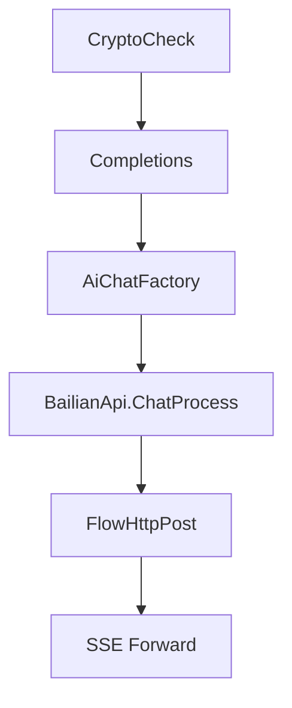
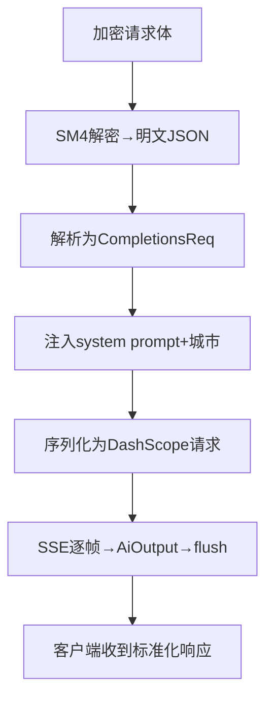
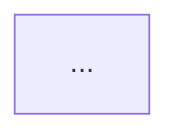

# Code Map — Supplement AGENTS.md with Navigation Maps

Generate `CODEMAP.md` that helps the agent (and developers) quickly locate code for specific tasks and understand core business data flows. This is a **supplement to `AGENTS.md`**, not a replacement — do not duplicate project overview, commands, or conventions that belong there.

Output takes one of two shapes, decided by project size in Step 2:

**Single-layer** (small project):
```
CODEMAP.md               # everything: module table + task index + call chains + dependency graph
CODEMAP-changelog.md     # change log
```

**Two-layer** (large project):
```
CODEMAP.md               # PURE INDEX only: tech stack + domain dirs + top-level task index + dependency graph (≤60 lines)
.codemap/
├── README.md            # document map — link guide to every domain doc
└── domains/
    └── <domain>/
        ├── tasks.md     # this domain's task index (preconditions + pitfalls)
        └── flows.md     # this domain's call chains + its own Change Log
```

The key invariant: **the agent reads `CODEMAP.md` first, then drills into a domain doc only when the task needs it.** The top-level file must stay small enough to be cheap to load on every session.

> Scripts ship in two forms: `.sh` for Unix/macOS/Git Bash, `.ps1` for Windows PowerShell. Pick by OS — they are functionally identical.

## Design Principles

1. **Task-first navigation**: "To do X, edit these files" — developers (and the agent) search by task, not by module
2. **Parallel call chains via Mermaid**: Text can't show parallel branches well — use Mermaid subgraphs to show concurrent flows
3. **Core modules, concise**: Each business module gets ≤ 3 lines: responsibility, key files, key functions
4. **AGENTS.md aware**: Read `AGENTS.md` first, skip what it already covers, only add new navigation-level content
5. **Function-name anchors, never line numbers**: Reference code as `file path + function/symbol name` only — **do not store line numbers**. A line number is a *derived, decaying* value: it's meaningless the moment code moves and it fails *silently* (points you at the wrong line, no error). The symbol name is stable and greppable. When you actually want a line to jump to, compute it **fresh** with `scripts/where.sh <file> <symbol>` (or `scripts/where.ps1` on Windows) rather than trusting a stored number.

## Process

### Step 0: Check for AGENTS.md

If `AGENTS.md` exists in the project root, read it first. Note what sections it already covers (project overview, commands, conventions, tech stack). When generating CODEMAP.md, **do not repeat any of these** — skip project overview, commands, and development conventions, and focus entirely on navigation and data flow.

If `AGENTS.md` does not exist yet, proceed anyway and create a minimal stub in Step 7.

### Step 1: Discover

Find the program **entry point first** — look for the `main` function (Go's `func main()`, `main.go`, a `cmd/` directory, or whatever file registers routes / scheduled tasks / servers). The entry point is where every call chain you trace later must bottom out, so nail it down before anything else. Then map the top-level directory structure and identify the primary language/framework. Skip generated code (`.gen.go`, migrations, ORM output, etc.).

### Step 2: Layered Mode Decision

Run `scripts/count_sources.sh [project_root]` (or `scripts/count_sources.ps1 [project_root]` on Windows) for a deterministic non-generated source-file count. Then decide layering on **multiple signals** — go two-layer if **any** holds:

- non-generated source files > 50
- core business modules > 8 (see Step 3)
- the single-file `CODEMAP.md` would exceed ~200 lines (call chains + task index already look large)

Otherwise use **single-layer** mode.

### Step 3: Identify Core Business Modules

Don't list every directory. Identify the **business modules** — groups of files that serve a specific domain purpose. For each:

- **Responsibility**: 1 line what it does
- **Key files**: 2-4 file paths, each paired with its entry function name (no line numbers)
- **Key functions**: 2-3 function names that are the entry points

Example:
```
| 模块 | 职责 | 关键文件 | 入口函数 |
|------|------|---------|---------|
| AI 聊天 | 多模型路由 + SSE 转发 | `controller/aichat/default.go`, `service/aichatService/default.go`, `lib/utils/httputil/httputil.go` | `Completions()`, `AiChatFactory()`, `FlowHttpPost()` |
```

In two-layer mode, each module becomes a `<domain>` directory under `.codemap/domains/` (kebab-case name).

### Step 4: Build Task Index

For each major task a developer might want to do, list the files to edit — path + the **function/symbol** to touch (no line numbers) — plus **preconditions** and **pitfalls**:

```markdown
### To add a new AI provider
1. `internal/service/aichatService/default.go` → `AiChatFactory()` — add case, implement `ChatStreamModel` interface
2. `lib/utils/httputil/httputil.go` → `FlowHttpPost()` — add switch case, write `*HandleStreamResponse()`
3. `internal/consts/aiModel.go` → `ModelMapping` — add model constant, update `IsBailianModel()` if needed

**Precondition**: Confirm upstream API is OpenAI-compatible. If not, need custom request/response structs.
**Pitfall**: `FlowHttpPost` has no default fallback — new cases must be explicitly listed, or they fall through to `BailianHandleStreamResponse`.
```

Build this by tracing: where does the factory/registry live? where does the handler live? where are the types defined? For each task, ask: what must be true before this works? what edge case has burned someone before?

### Step 5: Trace Call Chains — Control Flow + Data Flow

Split call chains into two distinct types:

**Control Flow** (谁调谁 — explicit function calls):


**Data Flow** (数据怎么变 — where data is transformed):


**Parallel branches** (async/goroutine): Use Mermaid subgraphs or suffix labels like `G1[UpdateChatLog async]`.

**Tracing rules**:
- **Only trace explicit calls**: function A calls function B, switch case dispatch, interface implementation. Do NOT trace implicit calls (ORM hooks, decorators, reflection, event bus subscribers, middleware auto-registration).
- **If you can't find an explicit call, don't guess**: Omit that link rather than infer it. Better a shorter accurate chain than a longer misleading one.
- **Note gaps**: If a known runtime behavior (e.g., middleware order, ORM query) has no explicit source-level call, add a "未追踪" note under the diagram.

Each diagram ≤ 12 nodes — split at logical boundaries if needed. The 12-node limit is a readability heuristic, not a hard law: some flows are one cohesive chain (a linear pipeline where each step feeds the next) or a single decision tree whose branches only make sense together. Splitting those forces an artificial seam that hurts comprehension more than the length does. When a diagram is genuinely atomic like this, keep it whole and tag it with a no-split marker (see below) so future runs don't re-split it. Even then stay reasonable — past ~18 nodes the diagram itself is telling you the real flow is too tangled, and the fix is to simplify the code or the abstraction, not just the picture.

**Confidence labels**: After EACH diagram, add a line with confidence level AND a verification hint if not high:
- `<!-- confidence: high — explicit static calls only -->`
- `<!-- confidence: medium — inferred from naming convention → verify: grep "Register" in router/ to confirm handler binding -->`
- `<!-- confidence: low — inferred from runtime behavior, not found in source → verify: check middleware registration order in main.go -->`

This tells future agent instances not just which diagrams to trust, but **where to verify** before acting on them.

**No-split marker**: When you deliberately keep a diagram whole despite exceeding the node limit, record why on the same comment-line style as confidence:
- `<!-- no-split: linear ingest→validate→enrich→persist pipeline; splitting would orphan the data dependency between steps -->`

This is a signal to future runs (and the trimming rules below): the size was a judgment call, not an oversight — respect it unless the underlying flow itself changed. A no-split note without a real reason is just an excuse to dump a tangled diagram; if you can't name why the flow is atomic, it probably isn't, and you should split it.

### Step 6: Generate the Document

**Single-layer**: write everything into `CODEMAP.md` (see the single-layer template below), plus `CODEMAP-changelog.md`.

**Two-layer**: split as follows:
- `CODEMAP.md` — **pure index only**: tech stack (1 line), a domain table (one row per domain, linking to `.codemap/domains/<domain>/`), the cross-domain task index, and the dependency graph. Keep it ≤ 60 lines.
- `.codemap/README.md` — document map: a link guide to every domain doc, so the agent can navigate without reading the top file in full.
- `.codemap/domains/<domain>/tasks.md` — that domain's task index (preconditions + pitfalls).
- `.codemap/domains/<domain>/flows.md` — that domain's call chains + its own `## Change Log` section at the bottom.

Create directories as needed.

**Preserve human-authored content.** A live CODEMAP is co-maintained: people hand-add hard-won Pitfalls, invariants ("铁律"), and Preconditions that cannot be re-derived from source. When any CODEMAP file already exists, **back it up to `<file>.bak` first**, then **never delete or rewrite anything inside a manual-protection marker**:

```
<!-- manual: keep — hand-authored, do not auto-rewrite -->
... human notes / pitfalls / invariants ...
<!-- /manual -->
```

Regenerate only the auto-traced sections (module table, call chains, dependency graph) *around* these blocks. When you add a Pitfall or invariant yourself that future runs must keep, wrap it in the same marker.

### Step 7: Wire into AGENTS.md

After writing CODEMAP.md, **ensure `AGENTS.md` references it** so future agent instances load it automatically.

- If `AGENTS.md` exists: check whether it already contains a line instructing to read `CODEMAP.md`. If not, add one right after the project overview / before the first content section.
- If `AGENTS.md` does not exist: create a minimal stub containing just that reference line (plus the project name as title).

The line should be:

```
**Before any code editing task, read `CODEMAP.md`** — it contains task-based file indexes, call chain diagrams, and module entry points you need to be productive.
```

Do NOT overwrite `AGENTS.md` — only append this reference if it is missing.

### Step 8: Spot-check before trusting

Tracing call chains from source is exactly where an LLM hallucinates, so don't ship on self-rated confidence alone — **verify a sample before considering the map done**:

1. **High-confidence edges**: for every diagram tagged `confidence: high`, pick at least one edge (caller → callee) and confirm the call literally exists — `grep` the callee inside the caller's file/function. If it isn't there, fix the edge or downgrade the label. A `high` you never checked is a `medium` in disguise.
2. **Task Index symbols**: for each entry, confirm the named function/symbol still exists in the cited file (`scripts/where.sh <file> <symbol>`, or `scripts/where.ps1` on Windows). Drop entries whose symbol is gone.
3. **no-split markers**: confirm each `<!-- no-split -->` reason still matches the current flow.

Record what you actually checked under **Last Updated → Update checklist**, so the next run knows what was verified vs. assumed. Catching one fabricated call here is worth more than tracing ten more chains you never verify.

## Output Templates

### Single-layer template

```markdown
# [Project Name] — Code Map

**Location**: `CODEMAP.md`
Generated: [date]

## Core Business Modules

[Table: module | responsibility | key files | entry functions — ≤ 3 lines each, max 8 modules]

## Task Index

### [Task 1: e.g., "Add a new AI provider"]
[Numbered list of files to edit + the function/symbol to touch in each — no line numbers]
**Precondition**: ...
**Pitfall**: ...

## Call Chains

### [Flow 1: e.g., "Chat request — control flow"]

```mermaid
flowchart TD
    [explicit function calls, ≤ 12 nodes]
```

<!-- confidence: high — explicit static calls only -->
<!-- blind spots: [what this chain doesn't cover] -->

## Module Dependencies

```mermaid
flowchart TD
    [compact dependency graph — ≤ 12 nodes]
```

[Brief: which modules are hubs, which are leaves, any circular dependencies]

## Last Updated

- **Generated**: [date]
- **Codebase state**: [brief]
- **Known gaps**: [what wasn't covered]
- **Update checklist**: [items to check next run]
```

### Two-layer templates

**Top-level `CODEMAP.md` (pure index, ≤ 60 lines):**

```markdown
# [Project Name] — Code Map

**Location**: `CODEMAP.md` (index) + `.codemap/domains/<domain>/` (details)
Generated: [date]

## Tech Stack
[1 line]

## Domain Index

| 领域 | 职责 | 文档 |
|------|------|------|
| auth | 认证与鉴权 | [tasks](.codemap/domains/auth/tasks.md) · [flows](.codemap/domains/auth/flows.md) |
| billing | 计费 | [tasks](.codemap/domains/billing/tasks.md) · [flows](.codemap/domains/billing/flows.md) |

## Cross-domain Task Index

### [Task that spans domains]
[files + functions]

## Module Dependencies

```mermaid
flowchart TD
    [compact dependency graph]
```

## Last Updated
- **Generated**: [date]
- **Update checklist**: [items]
```

**`.codemap/README.md` (document map):**

```markdown
# Document Map

- [auth — 认证与鉴权](domains/auth/tasks.md) · [flows](domains/auth/flows.md)
- [billing — 计费](domains/billing/tasks.md) · [flows](domains/billing/flows.md)
```

**`.codemap/domains/<domain>/tasks.md`:**

```markdown
# [domain] — Task Index

### [Task]
[files + functions]
**Precondition**: ...
**Pitfall**: ...
```

**`.codemap/domains/<domain>/flows.md`:**

```markdown
# [domain] — Call Chains

### [Flow]

<!-- confidence: ... -->
<!-- blind spots: ... -->

## Change Log

| Date | Business Area | Change |
|------|---------------|--------|
```

## Where the Change Log lives

The Change Log is **not** kept in the top-level `CODEMAP.md`. It is offloaded to keep the navigation index lean:

- **single-layer** → one file `CODEMAP-changelog.md`
- **two-layer** → no global log; each domain records its own changes in the `## Change Log` section at the bottom of `.codemap/domains/<domain>/flows.md`. A cross-cutting change is logged under whichever domain owns its entry point.

Each log file/section uses this format and rules:

```
| Date | Business Area | Change |
|------|---------------|--------|
| 2026-05-13 | Initial | CODEMAP created — AI chat routing, billing, agent system |
| 2026-06-01 | 计费 | PostConsume 新增企业成员共享池扣减分支（billing_service.go PostConsume） |
```

**Rules:**
- **Change**: state what business logic changed and **name the core function/symbol** whose behavior changed ("PostConsume 新增企业成员共享池扣减分支") — pin the delta to an entry point. **Name the function, never a line number**: the log is historical, so a line number recorded today is meaningless once the code moves, whereas a function name stays greppable. Never log the analysis action ("traced X", "analyzed Y").
- **Keep the most recent 20 entries per log file/section**; when trimming, drop oldest first — older ones fold into that file's `Last Updated` summary.
- Wrap a milestone entry in `<!-- manual -->` to exempt it from trimming.

## Managing CODEMAP Growth

CODEMAP grows as the project evolves. To prevent context bloat, keep the invariant: **top-level `CODEMAP.md` is always a small index; all detail lives in domain files.**

**Change Log with delta comparison**: Before analyzing, read the last entry of the relevant log — `CODEMAP-changelog.md` (single-layer) or the `## Change Log` section of each domain's `flows.md` (two-layer). Compare the current codebase against what was recorded last time. Append one row per changed business area capturing the **difference** — new functions, new routes, modified rules, removed features. If a business area is unchanged, write nothing for it. Only record actual deltas, not re-tracing the same code.

Example of good delta entries (name the function, never a line number):
- "AiChatFactory 新增 `OpenRouter` case，handler 为 `httputil.go` 的 `OpenRouterHandleStreamResponse`"
- "`billing_service.go` PostConsume 新增企业成员共享池扣减分支"
- "CompletionsV2 IntentType 路由新增 case 7 → 语音模型"

Example of bad entries:
- "分析了 AiChatFactory 函数"（这是动作，不是变化）
- "CODEMAP 更新了"（这是空话，没说变了什么）

**Section-aware thresholds** — but **anything inside a `<!-- manual -->` block is exempt from every trimming rule here**:

1. **Top-level `CODEMAP.md` over ~60 lines**: it stopped being a cheap index. Move detail down — push a domain's task entries and call chains into `.codemap/domains/<domain>/`, leaving only the link in the domain table.
2. **Domain `flows.md` over ~200 lines**: split call chains into sub-documents (`flows-auth.md`, `flows-billing.md`, etc.) and link them from the domain's `flows.md`.
3. **Change Log**: trim each to the most recent 20 entries (oldest fold into the `Last Updated` summary).
4. **Core Business Modules / Domain Index table**: Never trim — it's the primary navigation anchor. If > 10 domains, split rarely-used ones into a "扩展模块" subsection.
5. **Task Index**: Keep all entries. If an entry references a deleted file, remove it.
6. **Module Dependencies**: Keep one diagram. Never duplicate.

**Never full-rewrite over human content**: Even when a CODEMAP file is large or stale, do NOT blow it away. Always work incrementally: back up to `.bak`, keep every `<!-- manual -->` block **verbatim**, and re-scan only the auto-generated sections (module table, call chains, dependency graph) around them. If while re-scanning you spot a human-added Pitfall/invariant that isn't yet wrapped in a `<!-- manual -->` block, **wrap it in one rather than letting the re-scan drop it** — don't silently overwrite knowledge that's expensive to recover. If a domain has grown unwieldy, split into sub-domain files rather than deleting.

**Auto-trigger via script**: On every run, run `scripts/check_size.sh [project_root] [200]` (or `scripts/check_size.ps1 [project_root] [200]` on Windows) to see which files exceed the threshold. It reports the top-level `CODEMAP*.md` plus every `.md` under `.codemap/`. For each flagged OVER: move detail into domain/sub-domain files as above, keeping `<!-- manual -->` blocks verbatim. The script only measures size — what content moves where is your call from its output.

## Tips

The Process steps above are the detail; these are the things that most often get dropped:

- **Never repeat AGENTS.md**: skip anything it already covers (overview, commands, conventions); spend the space on navigation and data flow.
- **Keep `CODEMAP.md` a cheap index**: the top-level file is read on every session — if it's > 60 lines, you haven't offloaded enough to domain files.
- **Task Index is the most important section**: developers search by task first — keep it precise (file path + function name) with preconditions and pitfalls, not just "edit these files".
- **Anchor on file path + function name, never a line number**: write `controller/aichat/default.go → Completions()`. A stored line number decays the moment code moves; when you want a line, compute it fresh with `scripts/where.sh <file> <symbol>` (or `scripts/where.ps1` on Windows).
- **Add blind spots**: after each Call Chain, note what it does NOT cover (no retry, no test, upstream-timeout behavior) — the gaps matter as much as the chain.
